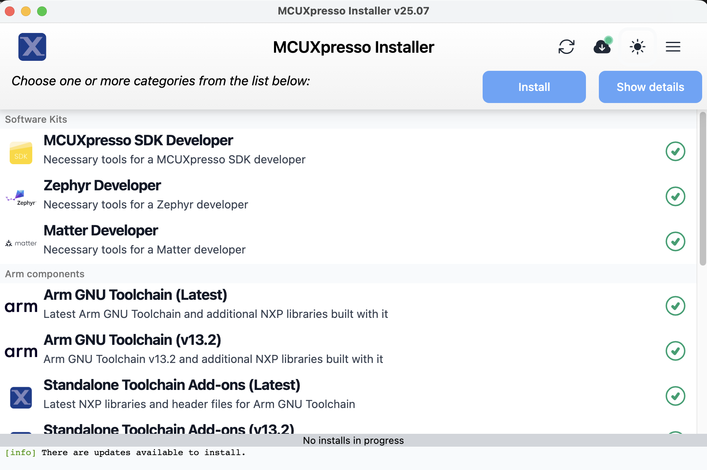
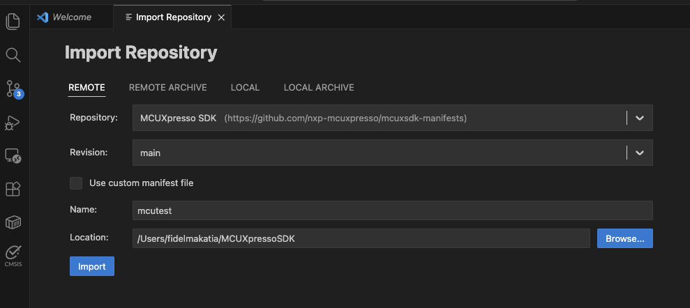
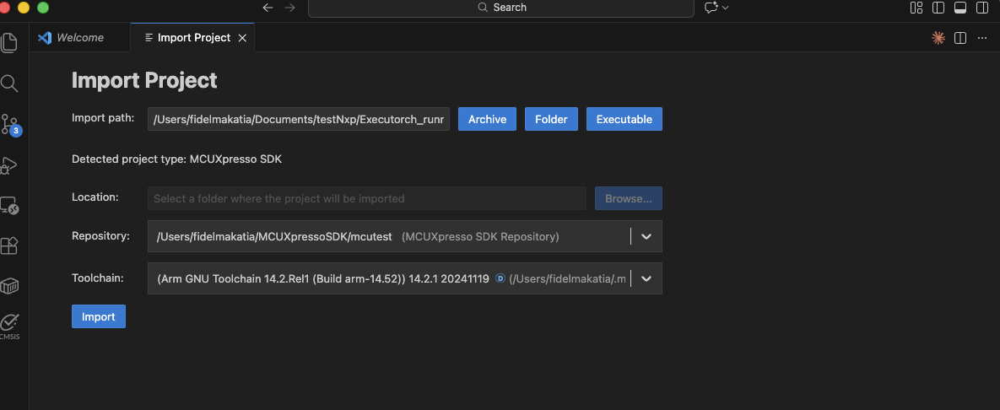
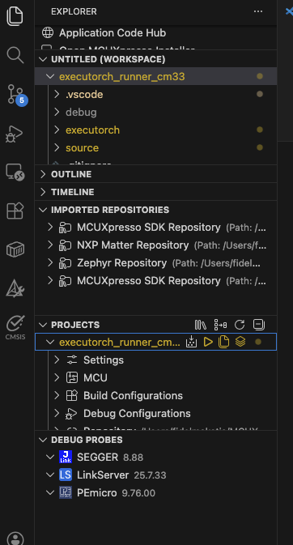

## Set up MCUXpresso for VS Code

Install the MCUXpresso extension in VS Code:



1. Open VS Code and press `Ctrl+Shift+X` to open Extensions
2. Search for "MCUXpresso for VS Code"
3. Click **Install** on the NXP extension


1. Open VS Code and press `Cmd+Shift+X` to open Extensions
2. Search for "MCUXpresso for VS Code"
3. Click **Install** on the NXP extension



## Install MCUXpresso SDK and Arm toolchain

Use the MCUXpresso Installer GUI to install the required SDK and toolchain components:



1. Press `Ctrl+Shift+P` to open the Command Palette
2. Type **MCUXpresso for VS Code: Open MCUXpresso Installer** and press Enter
3. Select the following components and click **Install**:
   - **MCUXpresso SDK Developer** (under Software Kits)
   - **Arm GNU Toolchain (Latest)** (under Arm components)
   - **Standalone Toolchain Add-ons (Latest)** (under Arm components)


1. Press `Cmd+Shift+P` to open the Command Palette
2. Type **MCUXpresso for VS Code: Open MCUXpresso Installer** and press Enter
3. Select the following components and click **Install**:
   - **MCUXpresso SDK Developer** (under Software Kits)
   - **Arm GNU Toolchain (Latest)** (under Arm components)
   - **Standalone Toolchain Add-ons (Latest)** (under Arm components)






## Clone the executor_runner repository

Clone the ready-to-build executor_runner project:

```bash
git clone https://github.com/fidel-makatia/Executorch_runner_cm33.git
cd Executorch_runner_cm33
```

The repository contains the complete runtime source code, pre-built ExecuTorch libraries, and build configuration for Cortex-M33 with Ethos-U65 NPU support.

## Apply required SDK patches

The executor_runner requires two patches to your MCUXpresso SDK. A script is included in the repository to apply them automatically:

```bash
./patches/apply_patches.sh
```

The script modifies two SDK files (with backups created automatically):

| Patch | What it does | Why it is required |
|-------|-------------|-------------------|
| **GOT initialization** | Adds `*(.got)` and `*(.got.plt)` inside the `.data` section of the linker script | Without this, the Global Offset Table is never initialized by startup code. This causes vtable corruption and a BUS FAULT during `load_method`. |
| **NPU log redirect** | Redirects Ethos-U driver `LOG_ERR`/`LOG_INFO` macros to the remoteproc trace buffer | Without this, NPU driver errors are only sent to UART and are invisible when reading `trace0` from Linux. |

{}
Run the patch script once after installing the SDK. The script detects if patches are already applied and skips them. If you reinstall or update the SDK, run the script again.
{}

## Pre-built ExecuTorch libraries

The repository includes pre-built static libraries in `executorch/lib/`, cross-compiled for Cortex-M33 with size optimization (`-Os`, MinSizeRel):

| Library | Size | Purpose |
|---------|------|---------|
| `libexecutorch.a` | 52KB | ExecuTorch runtime |
| `libexecutorch_core.a` | 217KB | Core runtime (gc-sections removes unused code) |
| `libexecutorch_delegate_ethos_u.a` | 19KB | Ethos-U NPU delegate backend |
| `libquantized_ops_lib_selective.a` | 7KB | Registers only `quantize_per_tensor.out` and `dequantize_per_tensor.out` |
| `libquantized_kernels.a` | 242KB | Kernel implementations (gc-sections removes unused code) |
| `libkernels_util_all_deps.a` | 308KB | Kernel utilities (gc-sections removes unused code) |

{}
The selective quantized ops library (`libquantized_ops_lib_selective.a`) registers only the two CPU operators needed at the NPU delegation boundary. The full `libquantized_ops_lib.a` registers all quantized operators and pulls in ~92KB of kernel code, which overflows the 128KB ITCM. If you rebuild the libraries from source, you must create this selective library manually.
{}

## Configure the project for FRDM-MIMX93

Open the project in VS Code:

```bash
code .
```

Initialize the MCUXpresso project:

1. Import the remote repository from MCUXpresso SDK:



1. Press `Ctrl+Shift+P` to open the Command Palette
2. Type **MCUXpresso for VS Code: Import Repository** and press Enter
3. Select the **Remote** tab and choose **MCUXpresso SDK**


1. Press `Cmd+Shift+P` to open the Command Palette
2. Type **MCUXpresso for VS Code: Import Repository** and press Enter
3. Select the **Remote** tab and choose **MCUXpresso SDK**






2. Import the cloned GitHub repository into the VS Code project:



1. Press `Ctrl+Shift+P` to open the Command Palette
2. Type **MCUXpresso for VS Code: Import Project** and press Enter
3. Navigate to the location of the cloned project files
4. Choose **Arm GNU Toolchain** and click **Import**


1. Press `Cmd+Shift+P` to open the Command Palette
2. Type **MCUXpresso for VS Code: Import Project** and press Enter
3. Navigate to the location of the cloned project files
4. Choose **Arm GNU Toolchain** and click **Import**






## Set environment variables

Set three environment variables to locate your toolchain and SDK. Configure these once for your user account so every project picks them up automatically.

### Required variables

| Variable | Description | Example Value |
|----------|-------------|---------------|
| `ARMGCC_DIR` | Path to the Arm GCC toolchain root | See platform instructions below |
| `SdkRootDirPath` | Path to the folder **containing** the `mcuxsdk/` subdirectory | See platform instructions below |
| `MCUX_VENV_PATH` | Path to the MCUXpresso Python venv executables | See platform instructions below |

### Toolchain directory names by platform



```text
arm-gnu-toolchain-14.2.rel1-mingw-w64-x86_64-arm-none-eabi
```


```text
arm-gnu-toolchain-14.2.rel1-x86_64-arm-none-eabi
```


For Apple Silicon:
```text
arm-gnu-toolchain-14.2.rel1-darwin-arm64-arm-none-eabi
```

For Intel Mac:
```text
arm-gnu-toolchain-14.2.rel1-darwin-x86_64-arm-none-eabi
```





Open PowerShell and run these commands to set persistent environment variables for the current user:

```powershell
# Set ARMGCC_DIR (adjust the path if you installed the toolchain elsewhere)
[Environment]::SetEnvironmentVariable("ARMGCC_DIR", "$env:USERPROFILE\.mcuxpressotools\arm-gnu-toolchain-14.2.rel1-mingw-w64-x86_64-arm-none-eabi", "User")

# Set SdkRootDirPath (the folder that contains the mcuxsdk/ subdirectory)
[Environment]::SetEnvironmentVariable("SdkRootDirPath", "$env:USERPROFILE\mcuxsdk_root", "User")

# Set MCUX_VENV_PATH (adjust if your venv has a different name, e.g. .venv_3_11)
[Environment]::SetEnvironmentVariable("MCUX_VENV_PATH", "$env:USERPROFILE\.mcuxpressotools\.venv\Scripts", "User")
```

Restart VS Code (or your terminal) after setting environment variables so they take effect.


Add these lines to `~/.bashrc` or `~/.profile`:

```bash
export ARMGCC_DIR="$HOME/.mcuxpressotools/arm-gnu-toolchain-14.2.rel1-x86_64-arm-none-eabi"
export SdkRootDirPath="$HOME/mcuxsdk_root"
export MCUX_VENV_PATH="$HOME/.mcuxpressotools/.venv/bin"
```

Then reload your shell configuration:

```bash
source ~/.bashrc
```


Add these lines to `~/.zshrc`:

```bash
# For Apple Silicon:
export ARMGCC_DIR="$HOME/.mcuxpressotools/arm-gnu-toolchain-14.2.rel1-darwin-arm64-arm-none-eabi"
# For Intel Mac, use this instead:
# export ARMGCC_DIR="$HOME/.mcuxpressotools/arm-gnu-toolchain-14.2.rel1-darwin-x86_64-arm-none-eabi"

export SdkRootDirPath="$HOME/mcuxsdk_root"
export MCUX_VENV_PATH="$HOME/.mcuxpressotools/.venv/bin"
```

Then reload your shell configuration:

```bash
source ~/.zshrc
```




## Understand the memory configuration

The Cortex-M33 has 128KB of ITCM (code) and 108KB of DTCM (data). The firmware also uses a 4MB reserved DDR region for the model and NPU scratch buffer. The memory configuration is defined in `CMakeLists.txt`:

```cmake
target_compile_definitions(${MCUX_SDK_PROJECT_NAME} PRIVATE
  ET_ARM_BAREMETAL_METHOD_ALLOCATOR_POOL_SIZE=0x6000    # 24KB method allocator
  ET_ARM_BAREMETAL_SCRATCH_TEMP_ALLOCATOR_POOL_SIZE=0x4000  # 16KB scratch allocator
  ET_MODEL_PTE_ADDR=0xC0000000  # DDR address where U-Boot loads the .pte model
)
```

| Setting | Value | Description |
|---------|-------|-------------|
| Method allocator | 24KB (`0x6000`) | Activation tensors and method metadata |
| Scratch allocator | 16KB (`0x4000`) | Temporary NPU operations |
| Model address | `0xC0000000` | Start of the 4MB reserved DDR region |

{}
The NPU scratch buffer is placed at DDR address `0xC0100000` (1MB after the model start). The Ethos-U65 accesses memory via the AXI bus and cannot reach the CM33's tightly-coupled DTCM. Placing the scratch buffer in DTCM causes a bus fault during inference.
{}

## Build the firmware

You can build the firmware using the Command Palette or the VS Code GUI.

Press `F7` or use the Command Palette:



1. Press `Ctrl+Shift+P` to open the Command Palette
2. Type **CMake: Build** and press Enter


1. Press `Cmd+Shift+P` to open the Command Palette
2. Type **CMake: Build** and press Enter



Alternatively, click the **Explorer** tab on the top left of VS Code and click the build icon under the **Projects** tab on the left pane. The icon is next to the project name, `executorch_runner_cm33`.



The build output shows the progress:

```output
[build] Scanning dependencies of target executorch_runner_cm33.elf
[build] [ 25%] Building CXX object source/arm_executor_runner.cpp.obj
[build] [ 50%] Building CXX object source/arm_memory_allocator.cpp.obj
[build] [ 75%] Linking CXX executable executorch_runner_cm33.elf
[build] [100%] Built target executorch_runner_cm33.elf
[build] Build finished with exit code 0
```

Verify the memory usage to ensure the firmware fits in the Cortex-M33:

```output
Memory region         Used Size  Region Size  %age Used
    m_interrupts:        1140 B       1144 B     99.65%
          m_text:      103476 B     129928 B     79.64%
          m_data:       61984 B       108 KB     56.05%
```

The text section uses approximately 80% of the 128KB ITCM, and data uses approximately 56% of the 108KB DTCM.

## Troubleshooting

**SDK patches not applied:**

If you see a BUS FAULT during `load_method` or vtable corruption errors, the GOT linker script patch has not been applied. Run:

```bash
./patches/apply_patches.sh
```

**Cannot find ExecuTorch libraries:**

Verify the pre-built libraries exist:

```bash
ls executorch/lib/libexecutorch*.a
```

The repository includes these libraries. If they are missing, re-clone the repository.

**Region m_text overflowed:**

The 128KB ITCM is nearly full. Ensure you are linking `libquantized_ops_lib_selective.a` (not the full `libquantized_ops_lib.a`) in `CMakeLists.txt`. The selective library registers only the two operators needed for NPU delegation.

**`resolve_operator` error for `quantized_decomposed::*`:**

This means the quantized operator kernels are not linked. Verify that `CMakeLists.txt` links `libquantized_ops_lib_selective.a` with `--whole-archive` and that `libquantized_kernels.a` and `libkernels_util_all_deps.a` are also linked.
